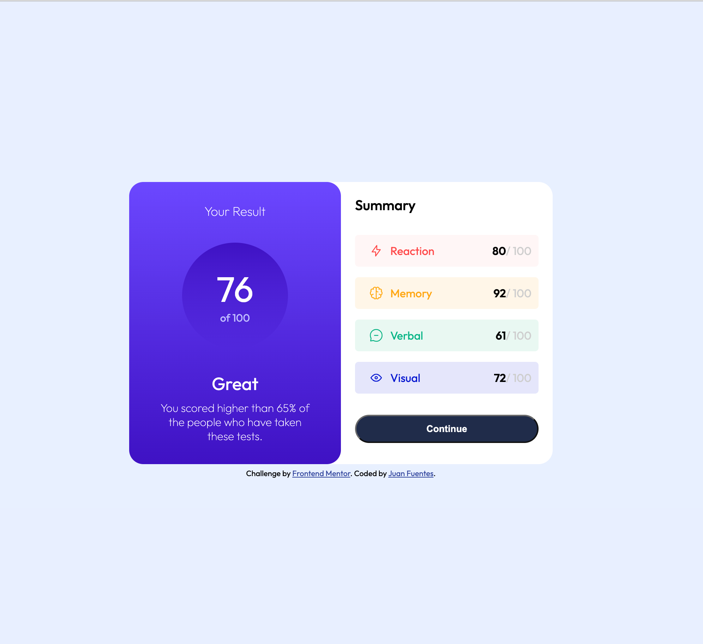
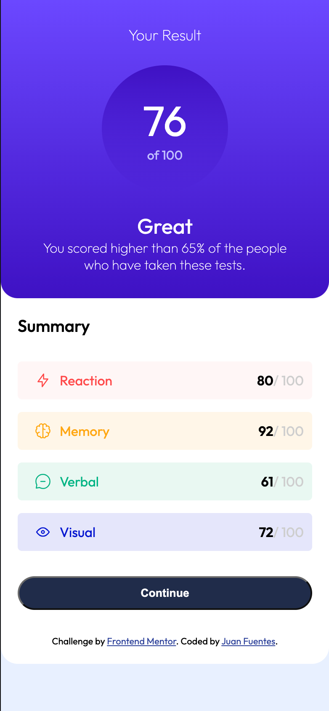

# Frontend Mentor - Results summary component solution

This is a solution to the [Results summary component challenge on Frontend Mentor](https://www.frontendmentor.io/challenges/results-summary-component-CE_K6s0maV). Frontend Mentor challenges help you improve your coding skills by building realistic projects. 

## Table of contents

  - [The challenge](#the-challenge)
  - [Screenshot](#screenshot)
  - [Links](#links)
  - [My process](#my-process)
  - [Built with](#built-with)
  - [What I learned](#what-i-learned)
  - [Author](#author)

### The challenge

Users should be able to:

- View the optimal layout for the interface depending on their device's screen size
- See hover and focus states for all interactive elements on the page
- **Bonus**: Use the local JSON data to dynamically populate the content

### Screenshot

### Links

- Solution URL: [Solution URL here](https://github.com/JuanFuentes20/ResultsSummaryComponent)
- Live Site URL: [Live site URL here](https://juanfuentes20.github.io/ResultsSummaryComponent/)

## My process

- Create a JS file for dynamically populating the summary section.
- Outline all different element in HTML and tackle one element at a time.

### Built with

- Semantic HTML5 markup
- CSS custom properties
- Flexbox
- Mobile-first workflow

### What I learned

During this challenge a refreshed my memory with JS. In addition I learned about the linear-gradient() function in CSS that enabled smooth color change within an element.

## Author

- Website - [Juan Fuentes](https://juanfuentes20.github.io/ResultsSummaryComponent/)
- Frontend Mentor - [@JuanFuentes20](https://www.frontendmentor.io/profile/JuanFuentes20)
